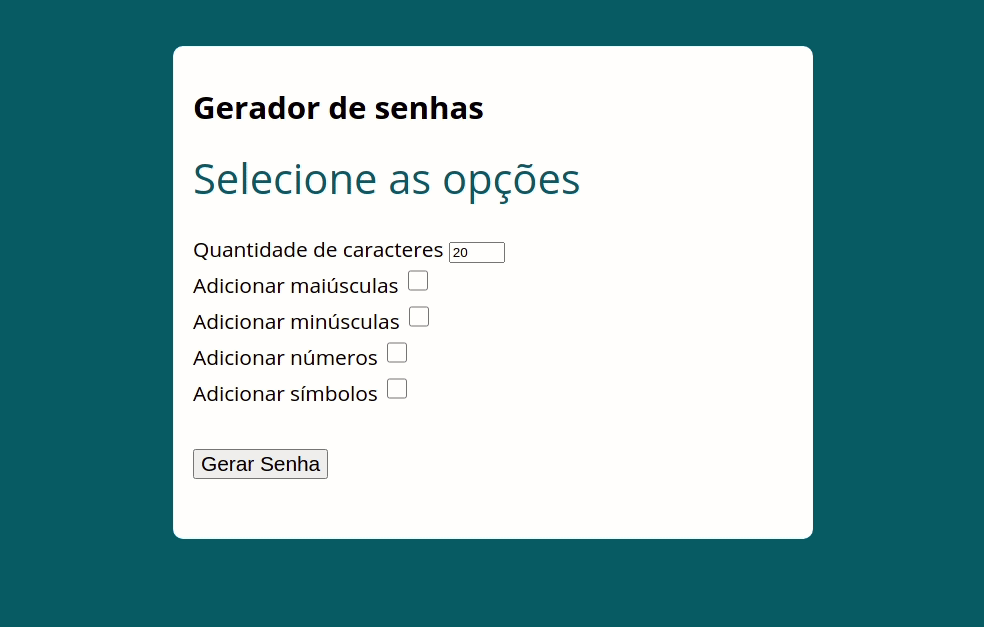

# Gerador de Senha em Javascript

<p align="center">
  
  
  
  
  
  
  
</p>


<br>

## O que é

Gerar senhas, podendo escolher a quantidade, se maiúsculas, minúsculas, com números e símbolos.

<br>

## Objetivo

Treinamento de [HTML](https://developer.mozilla.org/pt-BR/docs/Web/HTML), [CSS](https://www.w3schools.com/css/), [Javascript](https://developer.mozilla.org/pt-BR/docs/Web/JavaScript), [Webpack](https://webpack.js.org/) e [Node.js](https://nodejs.org/en/). Sempre consultando a documentação

<br>

## 🤝Créditos

Curso de Javascript e Typescript do [Luiz Otávio Miranda](https://www.udemy.com/user/luiz-otavio-miranda/)

<br>

## Instalação

Antes de começar, você vai precisar ter instalado em sua máquina as seguintes ferramentas:

- <b>[Git](https://git-scm.com)</b>

- <b>[Node.js](https://nodejs.org/en/)</b>

E também será preciso um editor, eu utilizo o <b>[VSCode](https://code.visualstudio.com/)</b>

<br>

## Clonar este repositório:

```bash
git clone https://github.com/leandross86/Gerador-de-Senha_Javascript.git

```

Depois disso acesse o diretório e instale as dependências executando o seguinte comando:

```bash
cd diretório
```

```bash
npm install # ou yarn install
```

<br>
Para rodar o webpack

```bash
npm run dev
```

<br>

## Como contribuir

- Fork esse repositório;
- Crie uma branch com a sua feature:

```bash
git checkout -b my-feature
```

- Commit suas mudanças:

```bash
git commit -m 'feat: My new feature'
```

- Push a sua branch:

```bash
git push origin my-feature
```

Depois que o merge da sua pull request for feito, você pode deletar a sua branch.
